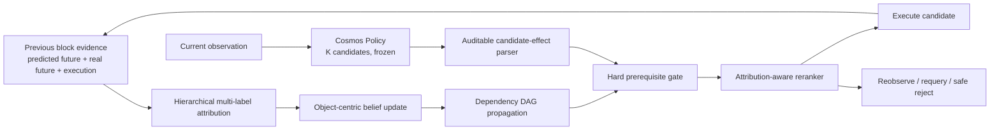

# CF-WAM: Belief-Constrained Candidate Reranking for World Action Models

**Research prototype · simulation first · no released checkpoint yet**

CF-WAM asks a concrete control question: when a world-action model's imagined block ending disagrees with reality, can an explicit explanation and task belief prevent the next query from selecting an action that depends on invalid assumptions?

The current method keeps the Cosmos Policy generator frozen. Cosmos produces `K` action-block candidates and their official values; CF-WAM explains the previous block mismatch, updates an auditable object-centric belief, rejects candidates whose prerequisites are contradicted, and reranks the remaining candidates. This is an action-selection mechanism, not merely an error log.



## What is new in this direction?

The official Best-of-N rule selects the candidate with maximum predicted value. CF-WAM inserts a structured decision layer:

1. **Hierarchical attribution** separates evidence reliability, world-state consistency, execution/contact consistency, task-stage consistency, and whether the cause is resolved. Coarse labels remain an evaluation projection, not the only representation.
2. **Belief state** stores task facts as `true / false / unknown`, with confidence, evidence and update history.
3. **Dependency-aware invalidation** revokes only the minimum contradicted fact, then propagates uncertainty to downstream facts.
4. **Candidate effects** expose each candidate's required facts and proposed effects through deterministic, testable rules.
5. **Hard gating before soft ranking** prevents a high Cosmos value from overriding a known prerequisite violation.

The key experimental claim is not assumed: under the same `K`, query budget and execution budget, belief constraints must demonstrably change selected actions and improve task success, safety proxies or successful-run steps without materially harming clean performance.

## Repository layout

```text
wam_reranking/
  contracts.py          typed public interfaces
  belief.py             three-valued belief and dependency propagation
  candidate_effects.py  interpretable action-block effect parser
  reranker.py           hard gate, soft score and explicit fallbacks
  refiner.py             future external action-residual interface
configs/
  task_bindings.json
  score_weights.template.json
docs/
  METHOD.md
  EVALUATION_PROTOCOL.md
tests/
  test_belief_reranking.py
```

Private daily-task names, cloud launchers, raw data, videos, checkpoints and abandoned recovery-treatment code are intentionally excluded. Their Git history remains available, but they are not part of the current public API.

## Quick start

Python 3.10+ is required.

```bash
python -m pip install -e .
python -m unittest discover -s tests -v
```

The package is independent of simulator ground truth and Cosmos internals. Integration code should translate the already-audited Cosmos Best-of-N output into these contracts. Upstream [Cosmos Policy](https://github.com/nvlabs/cosmos-policy) and [LIBERO](https://github.com/Lifelong-Robot-Learning/LIBERO) must be installed separately; their assets and checkpoints are not redistributed here.

## Research gates

The work advances only in this order:

1. train and validate hierarchical attribution;
2. prove belief-constrained reranking changes actions and improves closed-loop performance;
3. collect matched `(original candidate, execution outcome, better candidate or corrected action)` records;
4. train an external **belief-conditioned action refiner** that predicts a bounded `16 × 7` action residual;
5. only if candidate coverage remains the limiting factor, evaluate a LoRA or cross-attention adapter in the Cosmos action decoder.

> explain mismatch → update belief → constrain candidates → refine actions → condition the generator only if necessary

The action refiner and generator adapter are interfaces and planned experiments, not completed results.

## Current status and limitations

- Candidate generation remains native Cosmos Policy with a 16-action chunk.
- Attribution is evaluated at a complete block boundary; there is no claim of within-block prediction.
- The rule-based candidate-effect parser is an auditable first version, not a learned effect model.
- Soft-score weights are deliberately marked uncalibrated and cannot be used in deployment mode until frozen on a development split.
- No final benchmark result, pretrained model or paper acceptance claim is provided.

No project license has been selected yet. Public visibility alone does not grant reuse rights; a license will be added before a formal open-source release.
