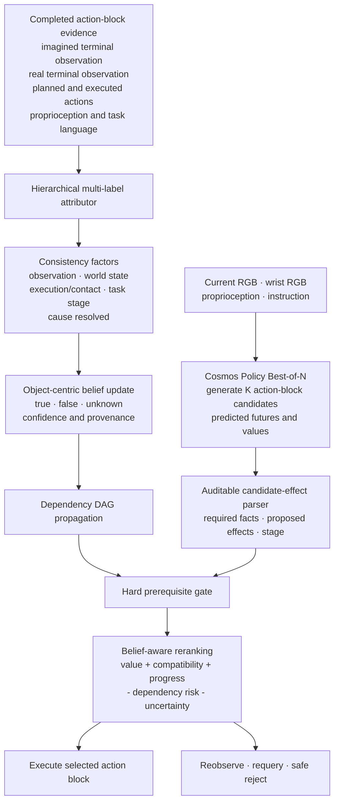

# CF-WAM: Belief-Constrained Candidate Reranking

CF-WAM is a candidate-selection and action-refinement framework for World Action Models (WAMs). It augments Cosmos Policy Best-of-N inference with hierarchical mismatch attribution, an explicit task belief, dependency-aware feasibility checks, and auditable candidate reranking.

The research question is:

> Can structured belief constraints select safer and more effective action blocks than value-only Best-of-N, under the same candidate and execution budget?

## Method



The official Cosmos rule is `argmax(value)`. CF-WAM first removes candidates that contradict high-confidence task facts, then ranks only the feasible set. A high predicted value cannot override a violated grasp, pose, reachability, or placement prerequisite.

## Current implementation

| Component | Status |
|---|---|
| Cosmos multi-query and value-selection interface | Verified |
| Block-aligned development dataset | 520 samples; grouped split and pairing audit complete |
| Deployment feature contract | Frozen observations, imagined terminal frames, actions and proprioception; simulator GT excluded |
| Hierarchical attribution interface | Implemented; model training awaits final manual label audit |
| Three-valued object-centric belief | Implemented |
| Dependency DAG and minimal invalidation | Implemented |
| Rule-based candidate-effect parser | Implemented |
| Hard gate, soft score and explicit fallback | Implemented; score weights intentionally uncalibrated |
| Closed-loop Cosmos candidate reranking | Next integration milestone |
| Belief-conditioned action refiner | Interface only; training data not collected yet |

The repository currently contains mechanism code and tests, not a pretrained attribution checkpoint or final benchmark claim.

## Environment

The target experimental stack is:

- [Cosmos Policy](https://github.com/nvlabs/cosmos-policy) as the WAM and action-block generator;
- [LIBERO](https://github.com/Lifelong-Robot-Learning/LIBERO) as the simulation benchmark;
- native `16 × 7` Cosmos action blocks;
- Cosmos Best-of-N candidates controlled by `num_queries_best_of_n`;
- frozen DINOv2-small visual features for the first attribution model;
- Python 3.10+.

This repository intentionally does not redistribute Cosmos Policy, LIBERO, DINOv2, model checkpoints, datasets, simulator assets, or machine-specific launch scripts. Install those components from their upstream projects for full experiments. The standalone mechanism and tests require only NumPy.

## Installation and tests

```bash
git clone https://github.com/scy040320/wam_project.git
cd wam_project
python -m pip install -e .
python -m unittest discover -s tests -v
```

## Package layout

```text
wam_reranking/
  contracts.py          attribution, belief, candidate and refiner contracts
  belief.py             belief update and dependency propagation
  candidate_effects.py  interpretable 16×7 action-block parser
  reranker.py           hard feasibility gate, soft score and fallback
  refiner.py             bounded action-residual application interface
configs/
  task_bindings.json
  score_weights.template.json
docs/
  METHOD.md
  EVALUATION_PROTOCOL.md
tests/
  test_belief_reranking.py
```

## Evaluation contract

All methods must use the same Cosmos checkpoint, candidate count `K`, query budget, 16-step horizon, initial states and intervention schedule.

Required comparisons include:

- Cosmos `K=1` direct execution;
- Cosmos Best-of-N with value-only selection;
- binary mismatch rejection/replanning;
- coarse attribution without dependency propagation;
- hierarchical attribution without dependency propagation;
- full belief-constrained reranking.

Primary metrics are task success, clean-scene degradation, false rejection and unsafe-action proxies. Successful-run action steps, WAM calls and latency are reported as secondary efficiency metrics. Thresholds and score weights must be frozen on a development split before held-out evaluation.

## Research roadmap

1. Train and validate hierarchical multi-label attribution.
2. Demonstrate that belief constraints change candidate selection and improve closed-loop task performance.
3. Collect matched `(original candidate, execution outcome, better candidate or corrected action)` records.
4. Train an external belief-conditioned action refiner that predicts a bounded `16 × 7` action residual.
5. Consider a LoRA or cross-attention adapter in the Cosmos action decoder only if candidate-set coverage is the verified bottleneck.

```text
explain mismatch
    → update belief
    → constrain candidates
    → refine actions
    → condition the generator only when necessary
```

## Scope

- Attribution currently uses complete action-block evidence; within-block prediction is not claimed.
- The candidate-effect parser is intentionally rule based and auditable in the first version.
- Unresolved or conflicting evidence maps to `unknown` and a conservative fallback.
- Score weights remain blocked from deployment until calibrated on the development split.
- No project license has been selected yet; a license will be added before formal open-source release.
