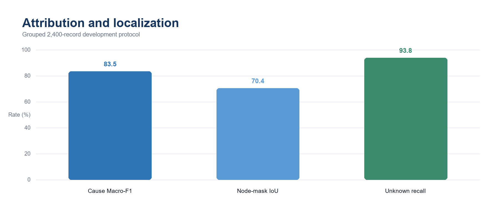
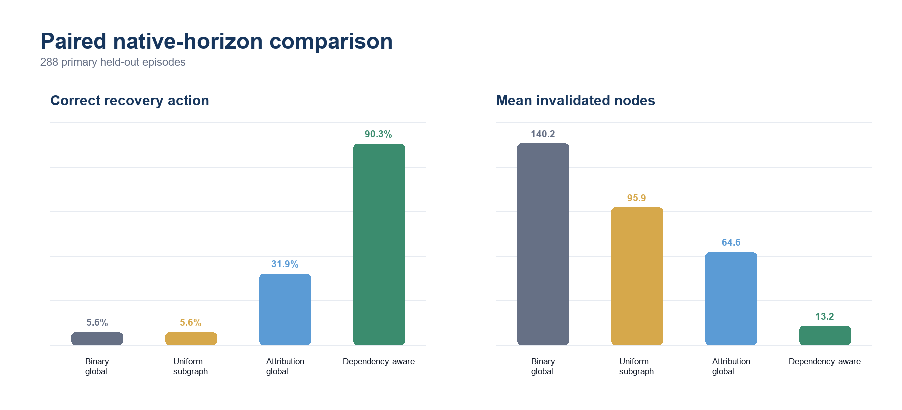

# CF-WAM: Counterfactual Mismatch Attribution for World Action Models

> **Research prerelease.** Attribution, localization, native-horizon online qualification, and a paired recovery comparison are complete. Recovery-cue integration is under validation; the final multi-task paper matrix has not started.

CF-WAM addresses a practical ambiguity in world action models (WAMs): when an imagined future differs from the next observation, the mismatch alone does not reveal whether the cause is visual occlusion, object displacement, action-execution noise, or an unknown event. Treating every mismatch as “discard everything and replan” can be unnecessarily expensive and can erase valid task state.

This repository implements an external, dependency-aware attribution and recovery layer around a frozen WAM. The first adapter targets [Cosmos Policy](https://github.com/nvlabs/cosmos-policy) on [LIBERO](https://github.com/Lifelong-Robot-Learning/LIBERO). CF-WAM does **not** modify or redistribute Cosmos Policy, LIBERO, or their checkpoints.

## Project status

- **Attribution and localization:** complete on a grouped 2,400-record development protocol. Held-out cause Macro-F1 is **0.835**, node-mask IoU is **0.704**, and unknown recall is **0.938**.
- **Native-horizon online qualification:** passed on 100/100 held-out episodes. Known-intervention routing is **59/60 (98.3%)**, unknown reaches a safe exit in **20/20**, and clean false safety stops are **0/20**.
- **Paired online comparison:** complete on 288 primary held-out episodes, plus 32 validation-overlap diagnostics excluded from inference. The full method reduces mean invalidated nodes from **140.22** (binary global) to **13.18** while retaining the same aggregate task success.
- **Current limitation:** object shifts are attributed correctly and routed to a local update in 13/14 cases, but final object-shift task success remains 0/14. A one-query recovery cue is now being validated to make the refreshed state affect the next frozen-policy decision.
- **Not yet complete:** the final 6–10 task main experiment, ablations, and cross-platform/cross-model generalization.





## Method

At each native 16-action boundary, the adapter records current primary/wrist observations, proprioception, the frozen WAM plan and imagined future, executed actions, the real observation at `t+16`, value change, and an online belief/provenance graph. Simulator truth is used only to create offline labels and evaluation masks; it is never an online input.

The trainable module is a lightweight two-layer graph attention network. It predicts:

1. a cause in `normal`, `visual_occlusion`, `object_shift`, `action_noise`, or `unknown`;
2. an affected-node mask over a reviewed task graph; and
3. a per-cause counterfactual residual explanation.

The recovery router converts those outputs into transparent actions: continue, reobserve, local belief/provenance invalidation, local action correction, or safe stop. “Local rollback” refers only to invalidating internal belief/provenance state and changing the next decision; it never claims to undo a physical action.

## Online comparison snapshot

The primary population uses held-out LIBERO states 32–49. All methods receive matched task, seed, condition, intervention timing, and budget; method order is cyclically balanced.

| Metric | Binary global | Uniform subgraph | Attribution global | Dependency-aware |
|---|---:|---:|---:|---:|
| Episodes | 72 | 72 | 72 | 72 |
| Task success | 59.7% | 59.7% | 55.6% | 59.7% |
| Correct recovery action | 5.6% | 5.6% | 31.9% | **90.3%** |
| Mean global refreshes | 15.07 | 0.00 | 6.88 | **0.24** |
| Mean invalidated nodes | 140.22 | 95.93 | 64.61 | **13.18** |
| Mean WAM calls | 22.69 | 22.72 | **14.33** | 16.07 |

For the dependency-aware method, clean, visual occlusion, and action noise each retain 100% task success in this screening population; unknown reaches the safe-stop exit in 15/15 cases. Object shift is the named negative result described above. Held-out results are not used to retune the frozen thresholds.

See [native-horizon control protocol](docs/NATIVE16_CONTROL_PROTOCOL.md) and [paired recovery comparison](docs/PAIRED_RECOVERY_COMPARISON.md) for protocol boundaries and interpretation.

## Repository layout

```text
cfwam/                 task graph, schemas, attribution model, abstention and recovery
configs/               reviewed task graphs and frozen development protocol
scripts/               collection, training, calibration, online runners and summaries
tests/                 graph, leakage, calibration and runner-contract tests
docs/                  protocol notes, comparison reports and public figures
```

Public filenames describe function rather than internal experiment-day identifiers. Cloud orchestration, private output paths, checkpoints, and large experiment artifacts are intentionally excluded.

## Installation

Create a working Cosmos Policy + LIBERO environment following the upstream setup instructions, using Python 3.10 for the current adapter.

```bash
git clone https://github.com/scy040320/wam_project.git cfwam
cd cfwam
python -m pip install -r requirements-gate1.txt
export PYTHONPATH="$PWD:${COSMOS_POLICY_ROOT}:${PYTHONPATH}"
pytest -q
```

`COSMOS_POLICY_ROOT` must point to a separately installed upstream checkout with access to the official assets. Never commit Hugging Face tokens, checkpoints, simulator data, or cache directories.

## Reproduce the development protocol

The manifest freezes 4 tasks × 3 phases × 5 conditions × 40 matched initial states = 2,400 records, using a grouped 24/8/8 train/validation/development-test split.

```bash
python scripts/build_development_manifest.py --root . --output outputs/protocol_v1
```

Collect one aligned development record:

```bash
python scripts/collect_libero_counterfactuals.py \
  --task-config configs/libero_task_0.yaml \
  --episode-id 0 --phase approach --condition normal \
  --output outputs/counterfactual_records
```

Train and evaluate the attributor only after grouped split validation:

```bash
python scripts/train_attributor.py --help
python scripts/evaluate_attributor.py --help
```

Freeze the native-horizon temporal guard from validation records only:

```bash
python scripts/calibrate_native16_temporal_guard.py \
  --input outputs/native16_validation \
  --output outputs/native16_temporal_guard
```

The semantic online entry points are:

- `scripts/run_binary_mismatch_baseline.py` — complete-episode image-MAE diagnostic;
- `scripts/run_dependency_aware_recovery.py` — early four-step integration diagnostic, not a final control result;
- `scripts/run_native16_temporal_guard.py` — native 16-action online controller with validation-frozen safety guard;
- `scripts/run_paired_recovery_comparison.py` — locked, resumable, same-seed A/B/C/D comparison;
- `scripts/summarize_online_control_qualification.py` and `scripts/summarize_paired_recovery_comparison.py` — descriptive summaries that never change frozen rules.

## Reproducibility and release boundaries

- Initial states are grouped so matched counterfactuals cannot cross train/validation/test splits.
- Unknown thresholds are selected once on validation data and frozen before held-out evaluation.
- The released checkpoint’s native 16-action horizon is preserved; imagined and real futures are aligned at `t+16`.
- Raw observations, videos, checkpoints, tokenizer files, large output directories, private manifests, and cloud-specific launchers are not in Git.
- A paper-ready release will add the final multi-task comparison package, dataset/checkpoint policy, license, and citation.

## Acknowledgements

This research adapter builds on the public interfaces of [Cosmos Policy](https://github.com/nvlabs/cosmos-policy), [LIBERO](https://github.com/Lifelong-Robot-Learning/LIBERO), and [DINOv2](https://github.com/facebookresearch/dinov2). Please follow their licenses and citation guidance.
