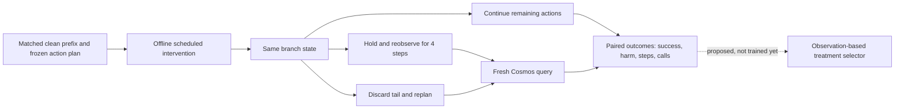

# CF-WAM: Counterfactual Recovery Decisions for World Action Models

**Research prototype · simulation-first · paired data collection in progress**

When execution deviates from a world-action model's plan, should a robot keep going, observe again, or replan immediately? CF-WAM studies **which recovery treatment helps in a given state**, rather than assuming that identifying an error cause guarantees useful recovery.

The goal is better task completion with fewer harmful interventions. Reduced execution cost is a secondary hypothesis, **not an established benefit**. Cosmos Policy remains the action generator; this project is an external recovery-decision layer, not a new foundation WAM.

## Research workflow



Current collection branches **inside** an action chunk, four steps after a scheduled intervention. The branch time is selected offline; there is **no deployed online mismatch detector or trained treatment selector yet**. A prediction for `t+16` is never compared with an observation at `t+4` as aligned supervision.

## Evidence so far

Completed stage-coverage pilot: **2 tasks × 3 development seeds × 2 stages × 4 conditions × 3 treatments = 144 branches**, forming 48 matched treatment triplets (not 144 independent initial states).

| Condition | Continue | Reobserve then replan | Immediate replan |
|---|---:|---:|---:|
| Normal | 12/12 | 11/12 | 12/12 |
| Visual occlusion | 12/12 | 11/12 | 12/12 |
| Object shift | 9/12 | 12/12 | 11/12 |
| Action noise | 12/12 | 12/12 | 12/12 |
| **Overall task success** | **45/48** | **46/48** | **47/48** |

These are descriptive development results, not a final benchmark. Recovery rescued some object-shift failures but also harmed normal/occluded episodes. Rescue events occurred in one task; the other had ceiling success. Thus **no universal best treatment, generalization, physical safety, or learned-policy advantage has been demonstrated**. An earlier fixed-early-checkpoint 72-branch pilot had 24/24 successes for every treatment.

The next frozen collection contains **576 planned branches over 24 task/seed groups**. Collection is in progress; no final result or selector training is claimed. See [protocol and interpretation](docs/PAIRED_TREATMENT_PROTOCOL.md).

## Public code layout

```text
recovery_decision/       current paired-treatment protocol and descriptive analysis
tests/test_treatment_contract.py
docs/PAIRED_TREATMENT_PROTOCOL.md
docs/LEGACY_ATTRIBUTION.md
cfwam/                  retained legacy attribution, graph and recovery primitives
configs/                retained legacy graph/protocol configurations
scripts/                retained legacy collection/training/control utilities
```

The new utilities use semantic names, independent of private daily task identifiers. Legacy code remains in its original locations to preserve imports and reproducibility; it is **not the new treatment-selection model**. See [release boundaries](docs/RELEASE_SCOPE.md).

## Quick start: lightweight public utilities

Python 3.10+; these utilities require only the standard library. Run from the repository root:

```bash
python -m recovery_decision.protocol --output /tmp/treatment_manifest.json
python -m unittest discover -s tests -p test_treatment_contract.py -v
python -m recovery_decision.analysis /path/to/results.json --output /tmp/paired_summary.json
```

The manifest builder freezes the 576-combination design; it **does not launch a simulator**. The analysis tool accepts a JSON list of complete matched triplets and reports rescues, harms, and resource differences restricted to jointly successful pairs. It rejects missing/duplicate arms. See the protocol document for the result schema.

The cloud simulator collector is **not yet a portable public entry point**. Do not treat the commands above as end-to-end reproduction. Upstream integration requires a separately installed [Cosmos Policy](https://github.com/nvlabs/cosmos-policy) and [LIBERO](https://github.com/Lifelong-Robot-Learning/LIBERO) environment; neither assets nor checkpoints are redistributed.

## What changed from the earlier project?

The earlier module classified mismatch causes and invalidated dependent graph state. Experiments showed that correct routing or fewer invalidated nodes did not, by themselves, establish improved task completion. The current direction first measures the consequences of different treatments from matched states, before learning a decision rule. Earlier attribution scores and control experiments belong to a different protocol and are retained in [historical notes](docs/LEGACY_ATTRIBUTION.md), not presented as validation of this direction.

## Next research gates

- Audit paired data, alignment, replay equality, and grouped splits.
- Establish repeatable rescue/harm differences without changing settings to favor a treatment.
- Train a treatment selector only after data review; compare against fixed-treatment policies.
- Ablate prediction inputs against observation-only inputs before claiming value from imagination.
- Evaluate closed-loop success and intervention harm on an independently frozen population.

There is no released selector checkpoint, final paper result, or publication claim. Raw data, videos, credentials, machine-specific launchers and large model assets are excluded. A project license has not yet been selected; public visibility does not grant an open-source license.

## Acknowledgements

Built around [Cosmos Policy](https://github.com/nvlabs/cosmos-policy) and [LIBERO](https://github.com/Lifelong-Robot-Learning/LIBERO); earlier visual attribution uses [DINOv2](https://github.com/facebookresearch/dinov2). Follow upstream licenses and citation requirements.
