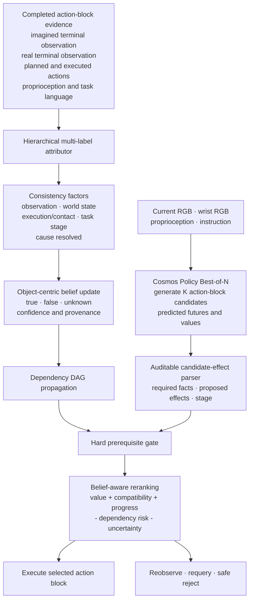

# CF-WAM: Belief-Constrained Candidate Reranking

CF-WAM is a candidate-selection and action-refinement framework for World Action Models (WAMs). It augments Cosmos Policy Best-of-N inference with hierarchical mismatch attribution, an explicit task belief, dependency-aware feasibility checks, and auditable candidate reranking.

The research question is:

> Can structured belief constraints select safer and more effective action blocks than value-only Best-of-N, under the same candidate and execution budget?

## Method


```mermaid
flowchart TD
    I[Completed action-block evidence<br/>imagined terminal observation<br/>real terminal observation<br/>planned and executed actions<br/>proprioception and task language]
    I --> A[Hierarchical multi-label attributor]
    A --> F[Consistency factors<br/>observation · world state<br/>execution/contact · task stage<br/>cause resolved]
    F --> B[Object-centric belief update<br/>true · false · unknown<br/>confidence and provenance]
    B --> D[Dependency DAG propagation]

    O[Current RGB · wrist RGB<br/>proprioception · instruction]
    O --> C[Cosmos Policy Best-of-N<br/>generate K action-block candidates<br/>predicted futures and values]
    C --> E[Auditable candidate-effect parser<br/>required facts · proposed effects · stage]

    D --> G[Hard prerequisite gate]
    E --> G
    G --> R[Belief-aware reranking<br/>value + compatibility + progress<br/>- dependency risk - uncertainty]
    R --> X[Execute selected action block]
    R --> Q[Reobserve · requery · safe reject]
```

The official Cosmos rule is `argmax(value)`. CF-WAM first removes candidates that contradict high-confidence task facts, then ranks only the feasible set. A high predicted value cannot override a violated grasp, pose, reachability, or placement prerequisite.

## Current implementation

| Component | Status |
|---|---|
| Cosmos multi-query and value-selection interface | Verified |
| Block-aligned development data | 520 auxiliary samples plus paired formal train/validation data; roles and groups remain isolated |
| Deployment feature contract | Frozen observations, imagined terminal frames, actions and proprioception; simulator GT excluded |
| Hierarchical attribution interface | D18-v18i is frozen for learned-track diagnostics; its one-shot task13/37/65 confirmation failed the normal-recall gate and is not presented as a deployment-ready attributor |
| Evidence routing | Action-record reliability and explicit requested-versus-applied command deviation are auditable hard routes; unsupported causes abstain as `cause_unresolved / evidence_insufficient` |
| Attribution engineering gate | Failed. On the frozen task13/37/65 confirmation, D18-v18i reached Macro-F1 0.717, unknown recall 0.694 and object-shift recall 0.650, but normal recall was 0.417; task65 object-shift recall was 0.20 |
| D19–D21 decision mechanism | V6 now parses every candidate independently: target/anchor displacement, typed relation change, grasp/release support and trajectory risk. Source-aware predicate gates, explicit fallbacks and frozen V5 value tie-breaking remain available. 49 local and 49 isolated-cloud tests pass. |
| Independent D19–D21 gate | Completed on task78/state35 and task81/state36 under clean/object-shift/execution conditions. Value-only, oracle-attribution and learned-attribution each achieved 0/6 because none of the 24 direct candidates or six requery fallbacks succeeded |
| Current bottleneck | Candidate-pool coverage, not demonstrated selector quality. The V5 rules are frozen; the six independent scenarios are retained as a negative result and are not used for post-hoc rule tuning |
| Non-bimodal coverage qualification | S0-v4 is running on 16 predeclared LIBERO-90 tasks at state45 with clean `K=4`. Tasks are stratified as generator-limited, selection-discriminative, cost-discriminative or trivial before any held-state test. task46 is a known mixed-outcome sentinel and cannot qualify the new pool. |
| Three-valued object-centric belief | Implemented; calibrated `true/false/unknown` factor states are preserved |
| Dependency DAG and minimal invalidation | Implemented |
| Rule-based candidate-effect parser | V6 implemented; exposes candidate-specific target displacement, target–anchor relation scores, grasp/release evidence, path efficiency, jerk and trajectory risk without outcome or simulator-GT inputs |
| Hard gate, soft score and explicit fallback | Implemented and tested; score weights intentionally blocked from deployment calibration |
| Closed-loop Cosmos candidate reranking | Integrated for the small independent gate; promotion is blocked until a preregistered task pool establishes a non-zero oracle ceiling |
| Belief-conditioned action refiner | Interface only; training data not collected yet |

The repository contains mechanism code, public contracts and tests, not checkpoints, datasets, or a final benchmark claim. The latest completed independent D19–D21 gate is a valid negative result: V5 caused no observed clean harm, but the frozen candidate generator supplied no successful action block for any of the six scenarios, so neither oracle nor learned reranking could improve outcomes. A preregistered qualification pool is now running and reports candidate-pool coverage separately from selector performance conditional on a successful candidate being present.

## Environment

The target experimental stack is:

- [Cosmos Policy](https://github.com/nvlabs/cosmos-policy) as the WAM and action-block generator;
- [LIBERO](https://github.com/Lifelong-Robot-Learning/LIBERO) as the simulation benchmark;
- native `16 × 7` Cosmos action blocks;
- Cosmos Best-of-N candidates controlled by `num_queries_best_of_n`;
- frozen DINOv2-small visual features for the first attribution model;
- Python 3.10+.

This repository intentionally does not redistribute Cosmos Policy, LIBERO, DINOv2, model checkpoints, datasets, simulator assets, or machine-specific launch scripts. Install those components from their upstream projects for full experiments. The standalone mechanism and tests require only NumPy.

## Installation and tests

```bash
git clone https://github.com/scy040320/wam_project.git
cd wam_project
python -m pip install -e .
python -m unittest discover -s tests -v
```

## Package layout

```text
wam_reranking/
  contracts.py          attribution, belief, candidate and refiner contracts
  belief.py             belief update and dependency propagation
  candidate_effects.py  interpretable 16×7 action-block parser
  relation_evidence.py target–anchor relation evidence and temporal candidate checks
  reranker.py           hard feasibility gate, soft score and fallback
  policy.py             value-only, oracle-hard-gate and learned-hard-gate selection paths
  refiner.py             bounded action-residual application interface
  paired_audit.py        paired-clean physical gates and cache-only diagnostics
  evidence_routing.py    hard action/command evidence routes and unresolved-cause abstention
  target_localization.py target-conditioned residual pooling from deployable RGB/text evidence
  contrastive.py         cross-task factor contrastive objective
configs/
  task_bindings.json
  score_weights.template.json
  d18_v5_frozen_contract.json
  d18_v9_sealed_confirmation_protocol.json
  d18_v15_data_roles_protocol.json
  candidate_pool_screening_v2.json
  candidate_pool_screening_v3_cached.json
docs/
  METHOD.md
  EVALUATION_PROTOCOL.md
  CONFIRMATION_PROTOCOL.md
tests/
  test_belief_reranking.py
  test_relation_evidence_temporal.py
scripts/
  preflight_candidate_pool.py
  analyze_candidate_pool_screen.py
docs/
  D19_D21_V5_GATE.md
  D19_D21_COVERAGE_PROTOCOL.md
```

## Evaluation contract

All methods must use the same Cosmos checkpoint, candidate count `K`, query budget, 16-step horizon, initial states and intervention schedule.

Required comparisons include:

- Cosmos `K=1` direct execution;
- Cosmos Best-of-N with value-only selection;
- binary mismatch rejection/replanning;
- coarse attribution without dependency propagation;
- hierarchical attribution without dependency propagation;
- full belief-constrained reranking.

Primary metrics are task success, clean-scene degradation, false rejection and unsafe-action proxies. Successful-run action steps, WAM calls and latency are reported as secondary efficiency metrics. Thresholds and score weights must be frozen on a development split before held-out evaluation.

## Research roadmap

1. Train and validate hierarchical multi-label attribution.
2. Demonstrate that belief constraints change candidate selection and improve closed-loop task performance.
3. Collect matched `(original candidate, execution outcome, better candidate or corrected action)` records.
4. Train an external belief-conditioned action refiner that predicts a bounded `16 × 7` action residual.
5. Consider a LoRA or cross-attention adapter in the Cosmos action decoder only if candidate-set coverage is the verified bottleneck.

```text
explain mismatch
    → update belief
    → constrain candidates
    → refine actions
    → condition the generator only when necessary
```

## Scope

- Attribution currently uses complete action-block evidence; within-block prediction is not claimed.
- The candidate-effect parser is intentionally rule based and auditable in the first version.
- Unresolved or conflicting evidence maps to `unknown` and a conservative fallback.
- Score weights remain blocked from deployment until calibrated on the development split.
- Calibration confidence does not turn silver supervision into human-validated causal truth.
- D18-v18i failed its one-shot task13/task37/task65 engineering confirmation and is used only as a frozen learned diagnostic track.
- D19–D21 V5 is frozen after an independent task78/task81 evaluation. No rule is changed in response to those six scenarios.
- The independent gate found zero successful candidates across 24 direct candidates and six requery fallbacks. Therefore it cannot establish a selector advantage, even with oracle attribution.
- The next evaluation uses a two-stage frozen pool. S0 screens 16 tasks at state45 with `K=4`; only non-sentinel tasks with mixed success or measurable successful-run cost spread enter S1. S1 uses held state46, `K=8`, and clean/object-shift/execution conditions. Both stages report every rejected task and separate candidate coverage (oracle ceiling) from conditional selector accuracy and outcome improvement.
- The original S0-v2 task list required 16 uncached T5-11B prompts. Two preparation attempts were killed before encoding by the cloud container's 62GiB cgroup while reading a 45GB monolithic checkpoint. The failure is retained. S0-v3 was therefore preregistered from exact texts already present in the same frozen T5 cache, based only on public task semantics and before any new rollout outcome.
- Action-record reliability is not learned: the acquisition-contract availability bit applies a hard `unknown` rule and is masked from the neural input.
- Existing features did not meet the preregistered feasibility thresholds for a 5 mm weak displacement. Those records map to `cause_unresolved / evidence_insufficient`; the method does not claim to identify their hidden physical cause.
- Paired counterfactual data uses `clean_a` versus QC-only `clean_b` after identical snapshot restoration. Cached-query versus forced re-observation differences are diagnostic and never replace the unchanged clean-pair hard gates.
- No project license has been selected yet; a license will be added before formal open-source release.
