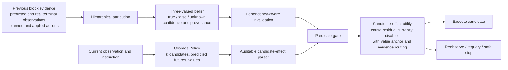

# CF-WAM: Belief-Constrained Candidate Reranking

CF-WAM is an auditable decision layer for World Action Models. It keeps the
Cosmos Policy generator frozen, attributes a completed action block's
prediction–reality mismatch, updates an object-centric belief state, and uses
that state to filter and rerank the next set of action-block candidates.

The central question is:

> Under the same candidate and execution budget, can structured mismatch
> attribution select a better action block than official value-only Best-of-N?

## Method


```mermaid
flowchart LR
    P[Previous block evidence<br/>predicted and real terminal observations<br/>planned and applied actions] --> A[Hierarchical attribution]
    A --> B[Three-valued belief<br/>true / false / unknown<br/>confidence and provenance]
    B --> D[Dependency-aware invalidation]

    O[Current observation and instruction] --> C[Cosmos Policy<br/>K candidates, predicted futures, values]
    C --> E[Auditable candidate-effect parser]
    D --> G[Predicate gate]
    E --> G
    G --> R[Candidate-effect utility<br/>cause residual currently disabled<br/>with value anchor and evidence routing]
    R --> X[Execute candidate]
    R --> F[Reobserve / requery / safe stop]
```

The deployment path never receives simulator state, intervention labels,
success labels, or post-execution candidate outcomes. Candidate outcomes are
used only to train or evaluate the selector.

## Current research status (2026-10-07)

The recovery-coupled selector is **not yet admitted for training**. Frozen
attribution and selector models and their original results are retained.

- The whole-training contract now distinguishes entry checks, future
  predicate use times, and predeclared next-boundary observation goals.
  Only real, before-derived active needs can create learned recovery heads.
  Missing evidence is masked, not relabeled negative. All active targets and
  the real full/masked/shuffled/no-dependency/effect-only producer must pass
  together; synthetic control tests do not admit a training dataset.
- A historical audit found after-quality records for 770 of 797 aligned
  blocks. All 52 historical negative records were byte-checked; 50 also have
  aligned after-quality and can be recomputed as observer auxiliary labels.
  The 770 logical joins are **not** all byte-admitted training samples, and
  selected-arm histories are not whole-pool counterfactual supervision.
- One real four-candidate pool has its own observations, predictions and
  actions, but lacks saved fresh query proprio and a trustworthy pre-update
  belief. Private simulator state and post-selection belief cannot fill
  those deployment-input gaps. Its true active recovery targets are unknown.
- The Python-3.10-compatible bounded evidence probe was uploaded, hash-checked
  and compiled on the original host. It stopped before its first policy query:
  wrist pixel differences above 5 occupy 7.0648%, exceeding the frozen 6%
  gate. Total consumption is 0 queries and 16 action steps, within the
  cumulative caps of 8 queries and 288 steps. No scientific retry or training
  was launched; failed artifacts and the saved source snapshot are retained.
- A separate interface audit found that a converter projects a frozen normal
  prediction to unknown while retaining normal confidence (0.01961). This
  semantic mismatch is diagnosed, not fixed or claimed to explain a measured
  selection failure. Models and thresholds were not changed.
- Canonical restored clean-A/B comparisons are a **pending proposal**, not an
  implemented comparison-contract change. Original Gate3 and the main study
  remain unapproved. See [the recovery contract](docs/joint_recovery_training_contract.md).

### Earlier frozen evidence

- Frozen trusted-evidence policy V8 completed 64 consumed development scenes:
  value-only 34 successes, candidate-only 38, full 38. Full has four gains and
  zero success harms versus value-only, but one gain and one harm versus
  candidate-only. V8 changes no outcome or execution cost relative to V6.
- The learned cause-score gain is **zero**. Attribution remains active in
  belief updates, predicate gates and evidence routing, but its incremental
  benefit and dependency-graph necessity have not been established. Training
  calibration at gain 0.125 tied gain zero; gain 0.25 introduced a harm.
  This is not evidence of a beneficial jointly learned cause correction.
- A fixed four-arm, known-task/new-state mechanism study was launched:
  value-only, candidate-only, attribution+ranking without dependency edges,
  and full. Tasks 0/9/46/57 use two audited unused states each, four conditions,
  K=4, and identical 400-step/92-postfork-query budgets: 32 scenes, 128
  actual arm executions. Its protocol used mutually exclusive lanes and a
  16-scene quality pilot followed by the remaining 16 scenes, without outcome-based scene filtering
  or automatic tuning. Full and no-dependency differ only in graph edges.
  See [the frozen protocol](configs/known_task_fixed_budget_ablation.json)
  and [mechanism study contract](docs/FIXED_BUDGET_MECHANISM_ABLATION.md).
- This is main-experiment **preparation**, not a launched 20-task main study,
  original Gate3 approval, or evidence of generalization to unseen tasks.
  Attribution's task16 local gate remains failed. All failed scenes stay in
  the denominator; costs are compared on paired jointly successful scenes,
  charging logical WAM queries even when realizations are shared.

### Preserved earlier results

- The frozen attribution model uses 5,200 training and 1,732 validation
  samples (6,932 formal supervised records). Validation Macro-F1 is 0.8214;
  recall is 0.7897 for `normal`, 0.6752 for `unknown`, and
  1.0000/0.8490/0.9563/0.9959 for the four learned evidence factors.
  Aggregate development requirements are met, but task16 observable object
  shift is only 2/5: the original complete development gate remains **failed**.
  Later repair variants were not promoted because they regressed other metrics.
- Unobservable physical changes are routed to
  `evidence_insufficient` instead of forcing a pixel model to guess a hidden
  cause. Eighty invalid weak-joint supervision records are excluded by an
  immutable audit list; the raw data is not rewritten.
- With this imperfect attributor frozen, the latest joint selector reuses an
  audited six-task development pool: 192 pools, `K=4`, 768 candidate outcomes.
  Train selection succeeds in 102/144 vs. value-only 101/144 (oracle 107/144);
  validation succeeds in 34/48 vs. 33/48 (oracle 36/48). Each split has one
  improvement and zero success harms. All 49 zero-coverage pools are retained.
  Safe-residual calibration uses training data only; deployment replay agrees
  on every pool and all final selected outcomes are observed.
- This validation pool was previously consumed during development. These are
  bounded development results, not independent confirmation, causal evidence
  for attribution alone, or a main-experiment claim. Task16 is not in this
  six-task candidate pool.
- Main20 stage qualification still fails: nested `K=16` yields only three
  qualified tasks and four stages. Formal Main20 ranking collection has not
  started. The older 896-pool protocol is historical, not an active pipeline.
- Gate3 and the main experiment remain open. See
  [the current result record](docs/results/frozen_v8_joint_development_20261004.json)
  and [reproduction notes](docs/REPRODUCING_CURRENT_RESULT.md).
- The completed original five-arm, 64-scenario closed-loop study obtained
  value-only 38, candidate-only 39, and full 34 successes. All failed scenes
  and the flat/no-dependency ablations are retained. Subsequent numerical
  query differences motivated a shared-request replay, not removal of harms.
- Frozen source-scoped full policy V6 has now completed all 64 consumed
  development scenes with re-executed controls and an outcome-free shared
  query cache. Value-only succeeds in 34/64; candidate-only, the matched V4
  full reference, and V6 each succeed in 38/64. V6 has four gains and no
  success harm versus value-only, but one gain and one harm versus
  candidate-only. Execution/pairing/budget quality passes; the historical
  repair target (40 successes and zero harm to both controls) **fails**.
- V6's cause-residual gain is frozen at zero. Attribution still affects
  belief, gating and baseline routing; learned cause-score benefit and the
  necessity of attribution or the dependency graph are **not demonstrated**.
  On 37 jointly successful full/candidate-only scenes, mean total steps are
  149.84/150.43 and logical WAM calls 30.46/30.68. This small descriptive
  difference does not establish an efficiency benefit or include attribution
  compute overhead. The two controls' observed success union is 39 scenes,
  not a measured candidate-pool oracle ceiling.
- This replay consumes existing development scenes, not fresh independent
  confirmation. Cache hits still pay each arm's logical query budget and
  must not be advertised as deployment query savings. See the
  [frozen full-policy record](docs/results/source_scoped_closedloop_20261005.json)
  and [source-scoped reproduction contract](docs/SOURCE_SCOPED_CLOSED_LOOP.md).
- Condition branches now reuse one immutable public prefix, complete runtime
  snapshot, query observation, and source action per task/state. Three completed
  outcomes from the stopped engineering version were preserved, with exact
  source identity checks and zero-difference imported clean replays. Twenty
  repair contract tests passed; pairing tolerances were not relaxed.

## Components

| Module | Purpose |
|---|---|
| `contracts.py` | Typed attribution, belief, candidate, and refinement contracts |
| `belief.py` | Three-valued facts, provenance, and dependency propagation |
| `evidence_routing.py` | Hard evidence routes and unresolved-cause abstention |
| `target_localization.py` | Task-language-conditioned visual residual pooling |
| `relation_evidence.py` | Subject–anchor relation and temporal evidence |
| `supervision_contract.py` | Observable-factor masks and source-scoped pairing |
| `shared_source.py` | Immutable once-per-group snapshot, observation and action identity |
| `candidate_effects.py` | Auditable parsing of `16 × 7` action blocks |
| `reranker.py` | Predicate gate, score decomposition, and fallback |
| `candidate_utility.py` | Attribution-conditioned pairwise utility model |
| `policy.py` | Value-only and belief-constrained selection paths |
| `closed_loop.py` | Best-seed adapter and bounded recovery budget |
| `evidence_residual.py` | Shared candidate backbone and bounded cause residual |
| `source_scoped_policy.py` | Factor-specific belief confidence and uncertainty routing |
| `shared_query_cache.py` | Outcome-free immutable candidate realization sharing |
| `evidence_arbitration.py` | Trusted affirmative evidence and source-aware routing |
| `mechanism_ablation.py` | Frozen four-arm interface; graph-edge-only ablation |
| `closedloop_metrics.py` | Paired successes, success harms, steps and logical queries |
| `refiner.py` | Interface for a future bounded action-residual model |

## Installation

The standalone mechanism and unit tests require Python 3.10+ and NumPy:

```bash
git clone https://github.com/scy040320/wam_project.git
cd wam_project
python -m pip install -e ".[test]"
python -m pytest tests -q
```

Full robot experiments additionally require upstream
[Cosmos Policy](https://github.com/nvlabs/cosmos-policy),
[LIBERO](https://github.com/Lifelong-Robot-Learning/LIBERO), their model
checkpoints, and simulator assets. They are not redistributed here.

## Reproducibility layout

```text
wam_reranking/                  method implementation
configs/
  task_bindings.json           public task bindings
  score_weights.template.json  auditable score interface
  attribution_expansion_protocol.json
  candidate_collection_protocol.json
  joint_development_192_protocol.json
  mechanism_ablation_protocol.json
docs/
  METHOD.md
  DATA_PROTOCOL.md
  EVALUATION_PROTOCOL.md
scripts/
  preflight_candidate_pool.py
  audit_candidate_pool.py
  analyze_mechanism_ablation.py
  train_candidate_utility.py
  train_safe_residual_ranker.py
  audit_selector_replay.py
  validate_functional_evidence.py
tests/                          deterministic mechanism and protocol tests
```

Shell orchestration, checkpoints, raw datasets, videos, caches, and
intermediate experiment versions are intentionally excluded. Failed studies
remain recoverable from Git history and archived experiment manifests, but do
not remain as competing public interfaces in the repository.

Public filenames and entry points describe their function, not daily-plan
numbers. Frozen schema identifiers and historical experiment identities are
kept unchanged for compatibility; they are not new public interface names.
Runtime snapshot files are trusted local experiment artifacts. Do not load
pickled snapshots from untrusted sources.

Archived-source diagnostic Python entry points require their pinned external
artifacts; they are not a turnkey training pipeline. They must not be invoked
as replacements for the whole-training gate or an approved experiment protocol.

## Evaluation contract

All compared methods share the same Cosmos checkpoint, initial state,
intervention, action horizon, candidate count, query budget, and execution
budget. Report:

1. candidate-pool coverage: whether at least one candidate succeeds;
2. conditional selection success when a successful candidate exists;
3. overall task success and harm relative to value-only;
4. successful-run steps, WAM calls, latency, and risk proxies;
5. clean-scene degradation and explicit fallback frequency.

Zero-coverage pools remain in the denominator. An unexecuted fallback is
reported as unobserved, not silently converted into a task failure. Risk
proxies are diagnostic measurements, not claims of physical safety.

## Scope

- Attribution operates at complete action-block boundaries; within-block
  mismatch detection is not claimed.
- The candidate-effect parser is rule based and auditable.
- `unknown` and `evidence_insufficient` are explicit abstention states.
- Aggregate attribution metrics do not erase task16's failed local gate.
  Joint selection development gains do not substitute for Gate3 or an
  independent engineering evaluation.
- The action refiner and generator adapter remain future stages; they are not
  trained components in the current release.

No project license has been selected yet. A license must be added before a
formal public release.
