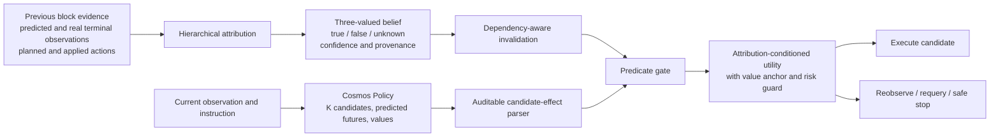

# CF-WAM: Belief-Constrained Candidate Reranking

CF-WAM is an auditable decision layer for World Action Models. It keeps the
Cosmos Policy generator frozen, attributes a completed action block's
prediction–reality mismatch, updates an object-centric belief state, and uses
that state to filter and rerank the next set of action-block candidates.

The central question is:

> Under the same candidate and execution budget, can structured mismatch
> attribution select a better action block than official value-only Best-of-N?

## Method


```mermaid
flowchart LR
    P[Previous block evidence<br/>predicted and real terminal observations<br/>planned and applied actions] --> A[Hierarchical attribution]
    A --> B[Three-valued belief<br/>true / false / unknown<br/>confidence and provenance]
    B --> D[Dependency-aware invalidation]

    O[Current observation and instruction] --> C[Cosmos Policy<br/>K candidates, predicted futures, values]
    C --> E[Auditable candidate-effect parser]
    D --> G[Predicate gate]
    E --> G
    G --> R[Attribution-conditioned utility<br/>with value anchor and risk guard]
    R --> X[Execute candidate]
    R --> F[Reobserve / requery / safe stop]
```

The deployment path never receives simulator state, intervention labels,
success labels, or post-execution candidate outcomes. Candidate outcomes are
used only to train or evaluate the selector.

## Current research status

- The D18 development gate uses 4,560 training and 1,296 validation samples.
  Validation Macro-F1 is 0.832; recall is 0.813 for `normal`, 0.667 for
  `unknown`, and 1.000/0.887/0.943/0.994 for the four learned evidence factors.
- Unobservable physical changes are routed to
  `evidence_insufficient` instead of forcing a pixel model to guess a hidden
  cause. Eighty invalid weak-joint supervision records are excluded by an
  immutable audit list; the raw data is not rewritten.
- On the frozen D25 development pool, value-only succeeds in 66/80 scenarios,
  the learned full method in 67/80, and the outcome oracle in 68/80. This is
  development evidence, not an independent benchmark result.
- A formal D21 candidate-ranking dataset is being collected under the frozen
  896-pool protocol in `configs/d21_formal_896_protocol.json`. Its pilot must
  pass coverage, pairing, budget, file, and hash gates before full collection.
- Gate M3 and the main experiment remain open. This repository does not claim
  a final cross-task improvement yet.

## Components

| Module | Purpose |
|---|---|
| `contracts.py` | Typed attribution, belief, candidate, and refinement contracts |
| `belief.py` | Three-valued facts, provenance, and dependency propagation |
| `evidence_routing.py` | Hard evidence routes and unresolved-cause abstention |
| `target_localization.py` | Task-language-conditioned visual residual pooling |
| `relation_evidence.py` | Subject–anchor relation and temporal evidence |
| `candidate_effects.py` | Auditable parsing of `16 × 7` action blocks |
| `reranker.py` | Predicate gate, score decomposition, and fallback |
| `candidate_utility.py` | Attribution-conditioned pairwise utility model |
| `policy.py` | Value-only and belief-constrained selection paths |
| `closed_loop.py` | Best-seed adapter and bounded recovery budget |
| `refiner.py` | Interface for a future bounded action-residual model |

## Installation

The standalone mechanism and unit tests require Python 3.10+ and NumPy:

```bash
git clone https://github.com/scy040320/wam_project.git
cd wam_project
python -m pip install -e .
python -m unittest discover -s tests -v
```

Full robot experiments additionally require upstream
[Cosmos Policy](https://github.com/nvlabs/cosmos-policy),
[LIBERO](https://github.com/Lifelong-Robot-Learning/LIBERO), their model
checkpoints, and simulator assets. They are not redistributed here.

## Reproducibility layout

```text
wam_reranking/                  method implementation
configs/
  task_bindings.json           public task bindings
  score_weights.template.json  auditable score interface
  d18_expansion_4800_protocol.json
  d21_formal_896_protocol.json
  d25_d28_preregistered_development_v1.json
docs/
  METHOD.md
  DATA_PROTOCOL.md
  EVALUATION_PROTOCOL.md
scripts/
  preflight_candidate_pool.py
  audit_d25_candidate_pool.py
  analyze_d25_d27_ablation.py
  train_d21_candidate_utility.py
  validate_d22_d24_functional.py
tests/                          deterministic mechanism and protocol tests
```

Machine-specific launchers, checkpoints, raw datasets, videos, caches, and
intermediate experiment versions are intentionally excluded. Failed studies
remain recoverable from Git history and archived experiment manifests, but do
not remain as competing public interfaces in the repository.

## Evaluation contract

All compared methods share the same Cosmos checkpoint, initial state,
intervention, action horizon, candidate count, query budget, and execution
budget. Report:

1. candidate-pool coverage: whether at least one candidate succeeds;
2. conditional selection success when a successful candidate exists;
3. overall task success and harm relative to value-only;
4. successful-run steps, WAM calls, latency, and risk proxies;
5. clean-scene degradation and explicit fallback frequency.

Zero-coverage pools remain in the denominator. An unexecuted fallback is
reported as unobserved, not silently converted into a task failure. Risk
proxies are diagnostic measurements, not claims of physical safety.

## Scope

- Attribution operates at complete action-block boundaries; within-block
  mismatch detection is not claimed.
- The candidate-effect parser is rule based and auditable.
- `unknown` and `evidence_insufficient` are explicit abstention states.
- D18 development success does not substitute for an independent engineering
  gate, and D25 development gains do not substitute for Gate M3.
- The action refiner and generator adapter remain future stages; they are not
  trained components in the current release.

No project license has been selected yet. A license must be added before a
formal public release.
